# Quick Repair - Team 6

Στα πλαίσια της εργασίας θα αναπτύξετε μια εφαρμογή η οποία θα διευκολύνει την εύρεση του κατάλληλου τεχνικού για επισκευή διαφόρων βλαβών στο σπίτι. Οι χρήστες θα είναι είτε τεχνικοί είτε πελάτες. Οι τεχνικοί θα κάνουν εγγραφή και θα εντάσσονται σε μια από τις διαθέσιμες κατηγορίες - ειδικότητες. Θα δηλώνουν τις περιοχές τις οποίες εξυπηρετούν, τις εργασίες τις οποίες προσφέρουν, τις μέρες και ώρες τις οποίες είναι διαθέσιμοι, τρόπους επικοινωνίας καθώς και τις τιμές. 

Οι πελάτες θα μπορούν να μπαίνουν στην εφαρμογή χωρίς εγγραφή και να βλέπουν τα στοιχεία των εγγεγραμμένων τεχνικών. Κάνοντας εγγραφή θα μπορούν να κλείσουν ραντεβού με τεχνικό της επιλογής τους. Η αναζήτηση των τεχνικών θα γίνεται με βάση την ειδικότητα, την περιοχή, τη διαθεσιμότητα και την τιμή ανά προσφερόμενη εργασία. Η εφαρμογή θα προβάλλει μόνο τις διαθέσιμες ώρες για τα ραντεβού. Όταν ο πελάτης κλείσει κάποιο ραντεβού η εφαρμογή θα ενημερώνει τον τεχνικό με τον τρόπο που αυτός έχει επιλέξει (e-mail, αριθμός τηλεφώνου, SMS) και αυτός θα μπαίνει στην εφαρμογή για να επιβεβαιώσει το ραντεβού. Με την επιβεβαίωση η εφαρμογή θα στέλνει e-mail στον πελάτη για την επιβεβαίωση του ραντεβού και θα δεσμεύει το συγκεκριμένο ραντεβού για τον συγκεκριμένο τεχνικό ώστε να μην είναι πλέον διαθέσιμο.
Με την ολοκλήρωση της εργασίας η εφαρμογή θα επιτρέπει την εξόφληση και αξιολόγηση του τεχνικού.

## Εισαγωγή
Στο παρόν έγγραφο αναλύονται λεπτομερώς οι προδιαγραφές των απαιτήσεων του λογισμικού Quick Repair. Στόχος αυτού του έργου είναι να δώσει την δυνατότητα στους τεχνικούς να προσφέρουν με ευκολία τις υπηρεσίες τους καθώς και να επιτρέψει στους χρήστες να αναζητήσουν τον κατάλληλο τεχνικό για την εργασία τους

### Εμβέλεια
Το Quick Repair είναι μια εφαρμογή Android που παρέχει ένα περιβάλλον χρήστη το οποίο δίνει την δυνατότητα αναζήτησης τεχνικού και διαμεσολαβεί για την επικοινωνία με αυτόν.

Αναλυτικότερα, ένας τεχνικός έχει την δυνατότητα να εγγραφεί στην εφαρμογή συμπληρώνοντας τα στοιχεία που είναι απαραίτητα για την ταυτοποίηση του (Ονοματεπώνυμο, τηλέφωνο, ΑΦΜ, τραπεζικός λογαριασμός) καθώς και την ειδικότητα του, τις εργασίες που μπορεί να αναλάβει, τις περιοχές και τίς ώρες που μπορεί να εξυπηρετεί και τον επιθυμητό τρόπο ειδοποίησης του (SMS, email). Επιπλέον, επιτρέπει σε χρήστες να αναζητήσουν τεχνικούς που πληρούν τα κριτήρια αναζήτησης τους (τύπος εργασίας, περιοχή, κόστος εργασίας, διαθεσιμότητα). Για να προγραμματίσει ένα ραντεβού εγγράφεται ως πελάτης στο σύστημα εισάγοντας τα προσωπικά του στοιχεία(Ονοματεπώνυμο, τηλέφωνο, ΑΦΜ, τραπεζικός λογαριασμός).
 
Για την δημιουργία ενός ραντεβού ο πελάτης θα πρέπει να επιλέξει την ημερομηνία που επιθυμεί, τον τρόπο πληρωμής, την διεύθυνση της τοποθεσίας συνάντησης και πιθανές λεπτομέρειες. Η εφαρμογή ειδοποιεί τον τεχνικό, ο οποίος θα επιβεβαιώσει ή θα απορρίψει την πραγματοποίηση του ραντεβού. Ο πελάτης θα ενημερωθεί άμεσα μέσω της εφαρμογής για την επιλογή του. Με την επιβεβαίωση ολοκλήρωσης της εργασίας από τον τεχνικό , θα πρέπει να επιλέγει εάν η πληρωμή έχει γίνει με μετρητά. Αν δεν το επιλέξει η εφαρμογή θα δεσμεύσει το ποσό από την κάρτα του πελάτη, στέλνοντας του μήνυμα για να καταθέσει μια αξιολόγηση(να βαθμολογήσει ή/και να σχολιάσει) για τις υπηρεσίες του. 
Πελάτες και τεχνικοί θα μπορούν να παρακολουθούν την εξέλιξη των ραντεβού τους, καθώς και να ακυρώσουν οποιοδήποτε από αυτά επιθυμούν πριν την προκαθορισμένη ώρα συνάντησης. Τέλος, η εφαρμογή θα κρατάει τα έσοδα των τεχνικών έτσι ώστε να γνωρίζουν τα κέρδη τους.
## Συνολική περιγραφή

### Επισκόπηση μοντέλου περιπτώσεων χρήσης

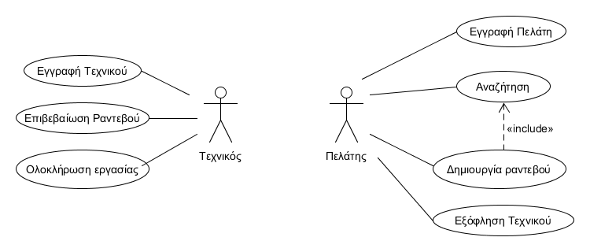

### Πίνακας με τους κωδικούς, τους τίτλους και μία σύντομη περιγραφή των περιπτώσεων χρήσης

Κωδικός περίπτωσης χρήσης | Τίτλος | Σύντομη περιγραφή
------------ | ------------- | ------------- 
1 | Εγγραφή πελάτη | Ένας πελάτης δημιουργεί έναν λογαριασμό στο σύστημα χρησιμοποιώντας τα προσωπικά του στοιχεία.
2 | Εγγραφή τεχνικού | Ένας τεχνικός δημιουργεί έναν λογαριασμό και επιλέγει ειδικότητα , εργάσιμες μέρες και ώρες , περιοχές , της εργασίες που προσφέρει , τρόπους επικοινωνίας και τιμές.
3 | Αναζήτηση | Ένας πελάτης εισάγει τα κριτήρια αναζήτησης (ειδικότητα, περιοχή, διαθεσιμότητα, τιμή ανά προσφερόμενη εργασία) και του εμφανίζει μια λίστα με τα διαθέσιμα ραντεβού.
4 | Δημιουργία ραντεβού | Ένας πελάτης επιλέγει τεχνικό , επιλέγει την διαθέσιμη ώρα για ραντεβού και τον επιθυμητό τρόπο πληρωμής (μετρητά, κάρτα) και πληροφορείται ο τεχνικός για αυτό το αίτημα(SMS/e-mail).
5 | Ολοκλήρωση εργασίας | Ο τεχνικός σημειώνει μια εργασία ως ολοκληρωμένη.
6 | Επιβεβαίωση ραντεβού | Ο τεχνικός επιβεβαιώνει η απορρίπτει ένα αίτημα για ραντεβού και ειδοποιείται ο πελάτης που έκανε την αίτηση. 
7 | Εξόφληση τεχνικού | Μετά την ολοκλήρωση εργασίας ο πελάτης πληρώνει τον τεχνικό με κάρτα αν αυτός ήταν ο επιθυμητός τρόπος πληρωμής και τον αξιολογεί. 
8 | Ταυτοποίηση χρήστη | Ο χρήστης είτε πρόκειται για πελάτης είτε για τεχνικός συνδέεται στο σύστημα χρησιμοποιώντας το όνομα χρήστη του και τον κωδικό του.

## Ειδικές Απαιτήσεις

### Ενδιαφερόμενοι του συστήματος

Σαν ενδιαφερόμενο μπορούμε να θεωρήσουμε τον Πελάτη. Ανάγκη του πελάτη είναι να μπορέσει να βρεί κάποιον τεχνικό με ευκολία που μπορεί να καλύψει της ανάγκες του δηλαδή να μπορεί να αναλάβει και να εκτελέσει την εργασία που θέλει ο πελάτης. Θέλει με εύκολο κκαι απλό τρόπο να μπορεί να κλείσει ραντεβού με τον καλύτερο τεχνικό για της ανάγκες του.

Σαν ενδιαφερόμενο μπορούμε να θεωρείσουμε και τον τεχνικό. Βασική ανάγκη του τεχνικού είναι να μπορέσει να γνωστοποιήσει τις υπηρεσίες που μπορεί παρέχει σε όσο τον δυνατό περισσότερο κόσμο. Θέλει ένα βολικό τρόπο να οργανώνει τα ραντεβού και να αποδέχεται νέα ραντεβού.

### Actors του συστήματος

Actor | Περιγραφή
------------ | -------------
Πελάτης | Πελάτης θεωρείται ο χρήστης της εφαρμογής ο οποίος αναζητεί κάποιον τεχνικό για την διεκπεραίωση κάποια εργασίας.
Τεχνικός | Τεχνικός θεωρείται ο χρήστης της εφαρμογής ο οποίος παρέχει μέσω αυτής την τις υπηρεσίες του πρός άλλους χρήστες της εφαρμογής (Πελάτες).

### Περιγραφές περιπτώσεων χρήσης

#### [ΠΧ1. Εγγραφή Τεχνικού](requirements/uc1-register-technician.md)

#### [ΠΧ2. Εγγραφή Πελάτη](requirements/uc2-register-customer.md)

#### [ΠΧ3. Αναζήτηση](requirements/uc3-search-technician.md)

#### [ΠΧ4. Δημιουργία Ραντεβού](requirements/uc4-create-appointment.md)

#### [ΠΧ5. Ολοκλήρωση εργασίας](requirements/uc5-work-completion.md)

#### [ΠΧ6. Επιβεβαίωση ραντεβού](requirements/uc6-confirm-appointment.md)

#### [ΠΧ7. Εξόφληση τεχνικού](requirements/uc7-technician-payoff.md)

#### [ΠΧ8. Ταυτοποίηση Χρήστη](requirements/uc8-validate-user.md)

## Συμπληρωματικές προδιαγραφές

### Απαιτήσεις διεπαφών

#### Διεπαφές χρήστη

Οι διεπαφή του χρήστη με το σύστημα θα περιλαμβάνει:
1. Κουμπιά επιλογής κατά την εκκίνηση της εφαρμογής όπου θα δίνεται η δυνατότητα στον χρήστη να επιλέξει αν πρόκειται για πελάτης ή για τεχνικός.
2. Μία φόρμα εισαγωγής των στοιχείων του χρήστη για ταυτοποίηση
3. Μια φόρμα για την εισαγωγή των εργασιών καθώς και των περιοχών και ωρών διαθεσιμότητας του τεχνικού κατά την εγγραφή του.
4. Μία λίστα με τους διαθέσιμους τεχνικούς κατόπιν αναζήτησης του πελάτη.
5. Μια φόρμα για την συμπλήρωση των κριτηρίων αναζήτησης για τεχνικό.
6. Μία λίστα με τις ειδοποιήσεις των ραντεβού που λαμβάνει ο τεχνικός. Κάθε στοιχείο της λίστας αυτή θα περιλαμβάνει
   1. Ένα κουμπί για την αποδοχή του ραντεβού
   2. Ένα κουμπί για την απόρριψη του ραντεβού
   3. Μία σύντομη περιγραφή του ραντεβού (περιοχή, ημερομηνία, ώρα)

#### Διεπαφές υλικού
Η εφαρμογή για την εκτέλεση της θα απαιτεί μια συσκευή με επεξεργαστή αρχιτεκτονικής ARM. Επιπλέον απαιτείται οθόνη αφής

#### Διεπαφές επικοινωνίας
Για την λειτουργία της η εφαρμογή απαιτεί σύνδεση στο διαδίκτυο για την εύρεση και την δημιουργία ραντεβού.

#### Διεπαφές λογισμικού
Το λογισμικό απαιτεί λειτουργικό σύστημα Android. Η ελάχιστη έκδοση που απαιτείται είναι η 6.0.

### Περιορισμοί σχεδίασης και υλοποίησης
Το λογισμικό θα πρέπει να συμμορφώνεται πλήρως με την νομοθεσία για την προστασία των προσωπικών δεδομένων (GDPR).
Η ανάπτυξη του λογισμικού θα πρέπει να γίνει με χρήση της γλώσσας Java 13. Η εφαρμογή θα πρέπει να είναι native android.

### Ποιοτικά χαρακτηριστικά

#### Απόδοση
Το λογισμικό θα πρέπει να είναι σε θέση να τρέχει σε συσκευές με χαμηλές δυνατότητες. Θα πρέπει να επεξεργάζεται και να διαβιβάζει τα δεδομένα και τις ενέργειες του χρήστη σε πραγματικό χρόνο. 
Η παροχή μιας υπηρεσίας από έναν νέο τεχνικό θα πρέπει να είναι άμεση όπως και η ειδοποίηση για ένα ραντεβού θα πρέπει να λαμβάνεται άμεσα από τον τεχνικό.

#### Διαθεσιμότητα
Το λογισμικό θα πρέπει να είναι διαθέσιμο για λήψη και εγκατάσταση από το PlayStore. Εναλλακτικά για συσκευές πού δεν το υποστηρίζουν θα μπορεί να γίνει λήψη του από την επίσημη ιστοσελίδα της εφαρμογής στην διεύθυνση 

#### Ασφάλεια
Το λογισμικό θα πρέπει να διαθέτει τρία επίπεδα εξουσιοδότησης.
1. Θα πρέπει να έχει το επίπεδο "Πελάτης" όπου θα απαιτείται εγγραφή του χρήστη για να μπορεί να κλείσει ραντεβού με κάποιον τεχνικό.
2. Θα πρέπει να έχει το επίπεδο "Επισκέπτης" όπου δεν απαιτείται εγγραφή και θα μπορεί να αναζητεί τεχνικό χωρίς παρόλα αυτα να μπορεί να κλείσει κάποιο ραντεβού
3. Θα πρέπει να διαθέτει το επίπεδο "Τεχνικός" όπου θα απαιτείται εγγραφή και κάποιος θα μπορεί να παρέχει υπηρεσίες προς τους υπόλοιπους χρήστες της εφαρμογής.

Ο χρήστης δεν θα μπορεί να έχει πρόσβαση σε λειτουργίες που απαιτούν εξουσιοδότηση ανώτερη του "Επισκέπτη" αν πρότινος δεν έχει ταυτοποιηθεί από το σύστημα. Επιπλέον δεν θα πρέπει να αποθηκεύονται τοπικά στην συσκευή κωδικοί του χρήστη καθώς και ευαίσθητα προσωπικά δεδομένα(ΑΦΜ, τραπεζικοί λογαριασμοί, διευθύνσεις).

#### Ευχρηστία
Το λογισμικό θα πρέπει να διαθέτει μια εύχρηστη διεπαφή χρήστη με μινιμαλιστική σχεδίαση και σκούρα χρώματα. Τα στοιχεία της διεπαφής θα πρέπει να είναι κατανοητά από χρήστες όλων των ηλικιακών ομάδων. Για την χρήση της εφαρμογής δεν θα πρέπει να είναι απαραίτητη η χρήση manual. Σε κάθε περίπτωση ωστόσο θα πρέπει να παρέχεται στο χρήστη βοήθεια σε σημεία όπου απαιτείται να εκτέλεση εκείνος κάποια ενέργεια.

## Υποστηρικτικό υλικό

### Μοντέλο πεδίου

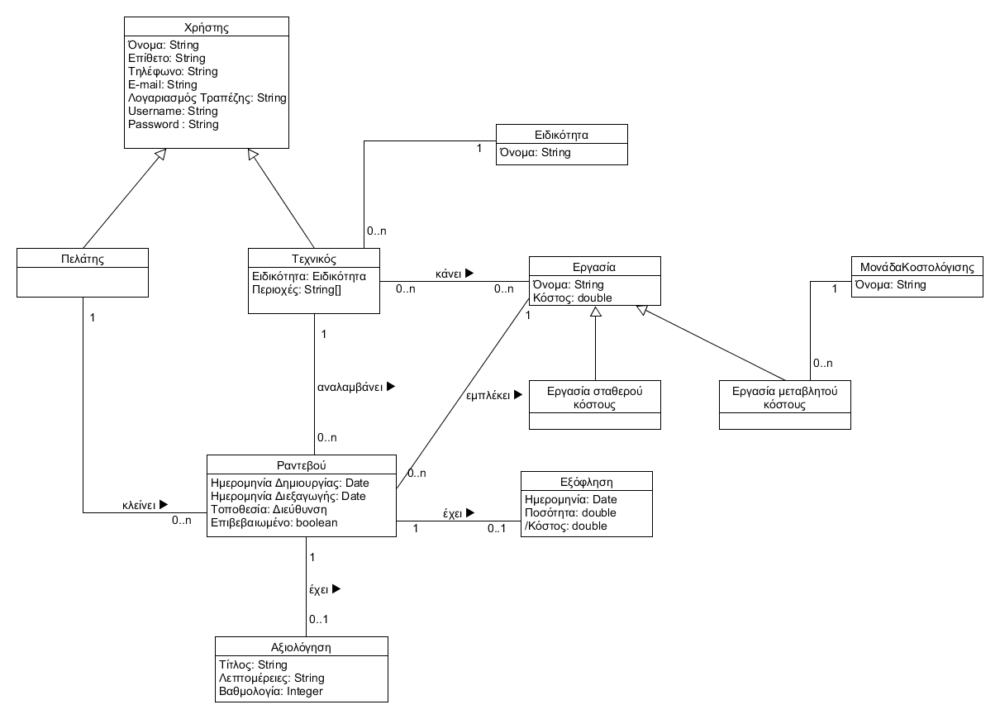

### Συμπεριφορές

#### Εγγραφή τεχνικού

#### Αναζήτηση

#### Δημιουργία ραντεβού 

### Επιχειρησιακοί κανόνες
Επιχειρησιακοί κανόνες | Περιγραφή
------------ | -------------
EK1 | To ΑΦΜ του τεχνικού πρέπει να έιναι μοναδικό.
ΕΚ2 | Το ΑΦΜ του τεχνικού πρέπει να υπάρχει στην Εφορία.
ΕΚ3 | Το username του κάθε χρήστη πρέπει να είναι μοναδικό.
ΕΚ4 | Ο αριθμός τηλεφώνου πρέπει να έχει 10 ψηφία.
ΕΚ5 | Το κόστος μιας εργασίας δεν μπορεί να είναι μηδέν ή αρνητικό.
ΕΚ6 | Όλα τα στοιχεία του πελάτη είναι υποχρεωτικά εκτός από τον τραπεζικό λογαριασμό.
ΕΚ7 | Όλα τα στοιχεία του τεχνικού είναι υποχρεωτικά. 
EK8 | Δεν μπορεί να διαγραφεί λογαριασμός πελάτη όπου εκρεμεί εξόφληση τεχνικού
ΕΚ9 | Δεν μπορεί να διαγραφεί λογαριασμός τεχνικού αν υπάρχουν μή εξοφλημένα αλλά επιβεβαιωμένα προγραμματισμένα ραντεβού.

## Ελεγχος συστήματος

### Αναφορά κάλυψης για το μοντέλο πεδίου

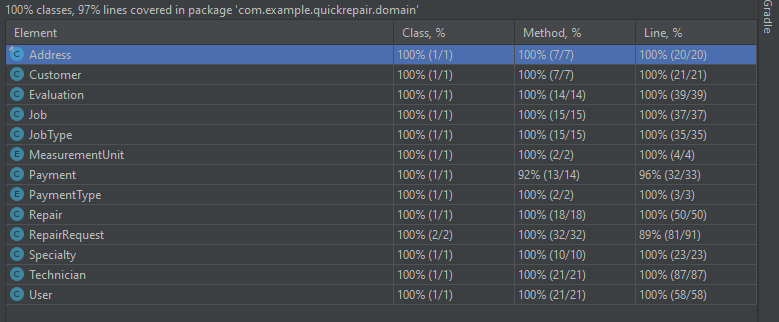

## Σχεδιασμός έργου

### Διαγράμματα κλάσεων

#### Διάγραμμα κλάσεων πεδίου

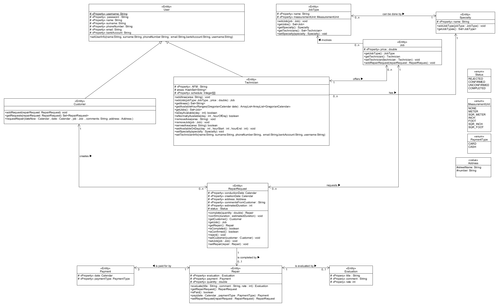

#### Διάγραμμα κλάσεων για την προβολή ολοκληρωμένων ραντεβού του πελάτη 

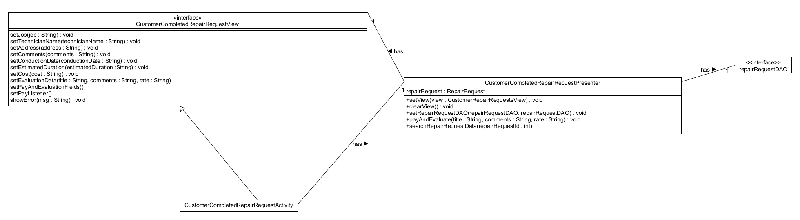

#### Διάγραμμα κλάσεων για την προβολή επιβεβαιωμένων ραντεβού του πελάτη 

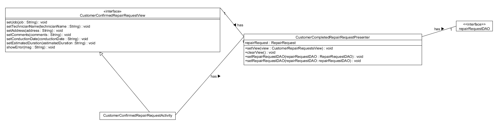

#### Διάγραμμα κλάσεων για την προβολή μη επιβεβαιωμέων ραντεβού του πελάτη 

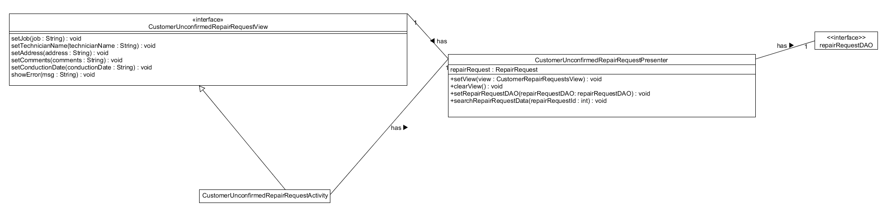

#### Διάγραμμα κλάσεων για την προβολή όλων των ραντεβού του πελάτη 

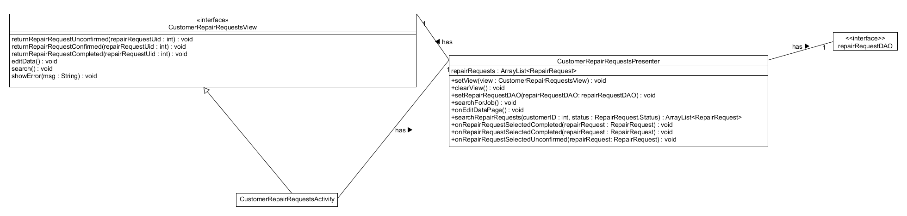

#### Διάγραμμα κλάσεων για την δημιουργια ραντεβού

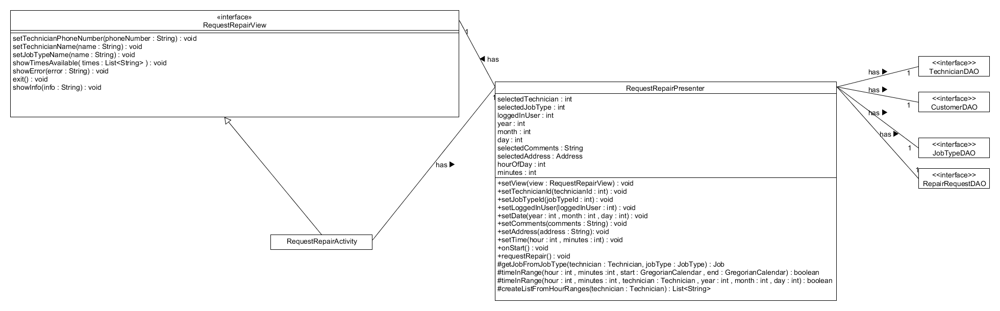

#### Διάγραμμα κλάσεων για την αναζήτηση τεχνικού

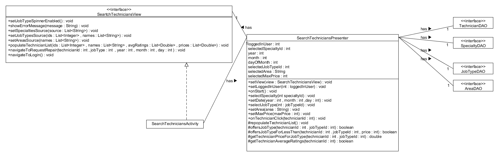

#### Διάγραμμα κλάσεων για την προβολή των ολοκληρωμένων ραντεβού του τεχνικού

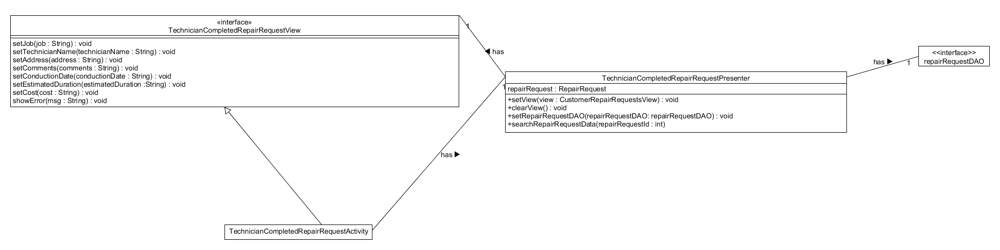

#### Διάγραμμα κλάσεων για την προβολή των επιβεβαιωμένων ραντεβού του τεχνικού

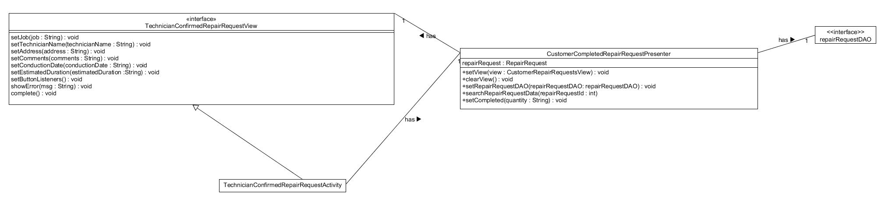

#### Διάγραμμα κλάσεων για την προβολή των  μη επιβεβαιωμένων ραντεβού του τεχνικού

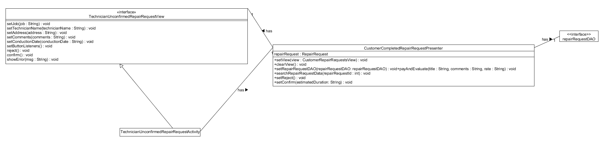

#### Διάγραμμα κλάσεων για το login

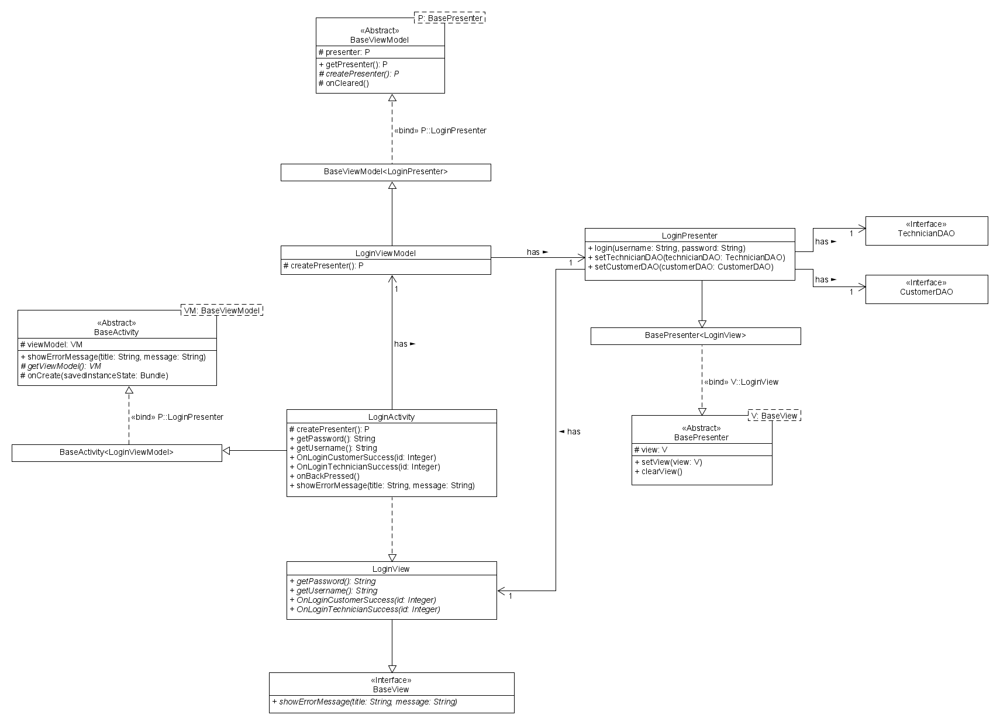

#### Διάγραμμα κλάσεων για την εγγραφή τεχνικού

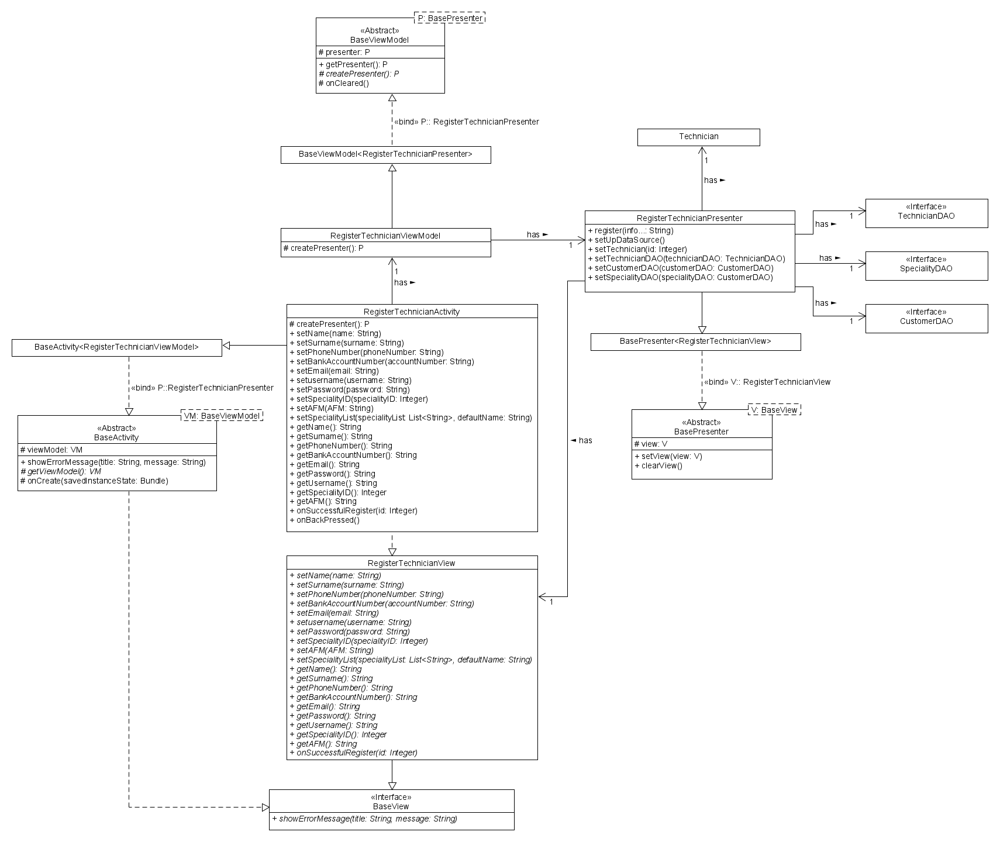

#### Διάγραμμα κλάσεων για την εγγραφή πελάτη

##### Διαγραμμα κλάσεων για προσθήκη η τροποποίηση περιοχής τεχνικού

##### Διαγραμμα κλάσεων για προσθήκη η τροποποίηση εργασίας τεχνικού

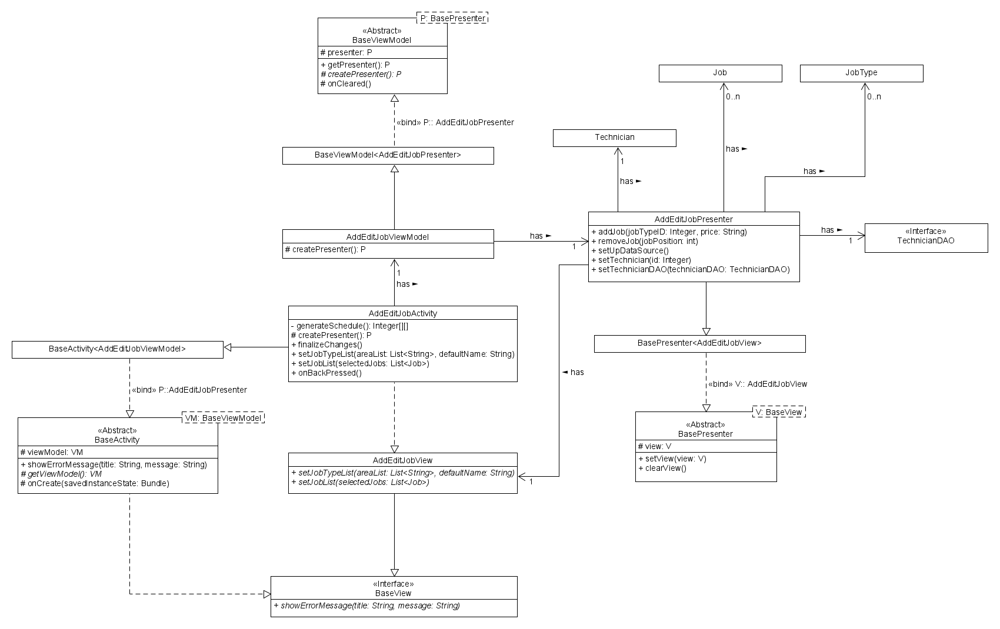

##### Διαγραμμα κλάσεων για προσθήκη η τροποποίηση ωραρίου τεχνικού

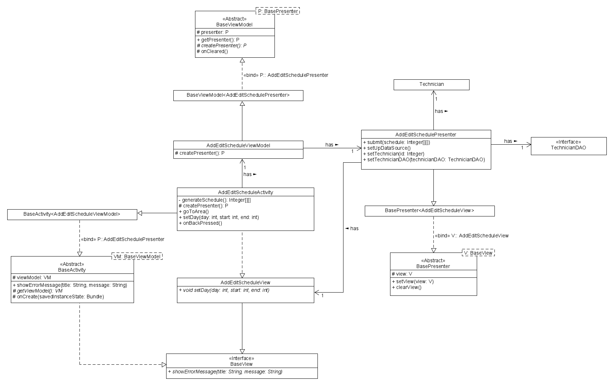

### Διαγράμματα ακολουθίας

#### Διαγράμματα ακολουθίας για σημαντικές μεθόδους του πεδίου

##### Pay

##### RequestRepair

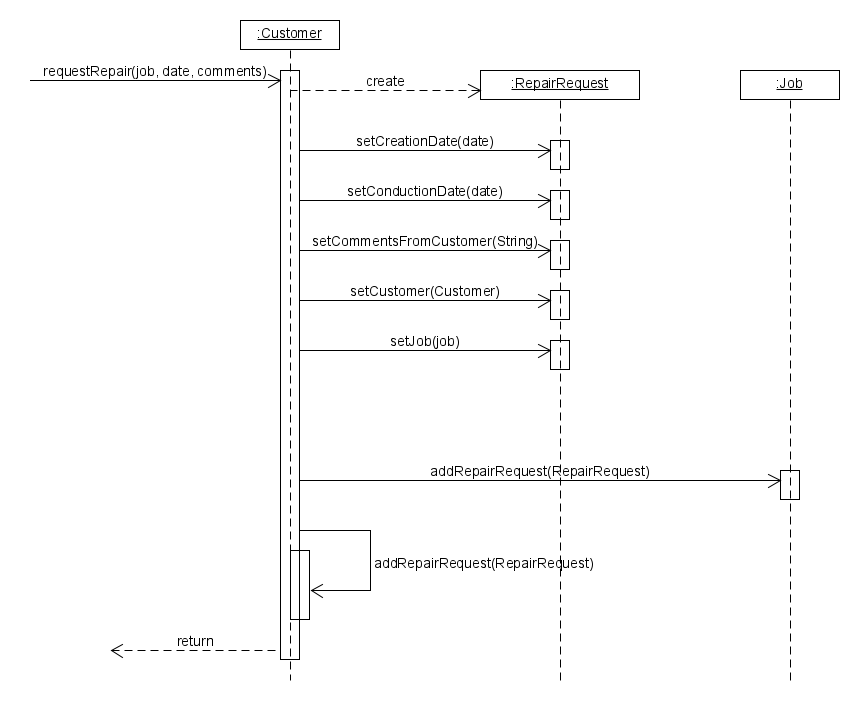

##### GetGaps

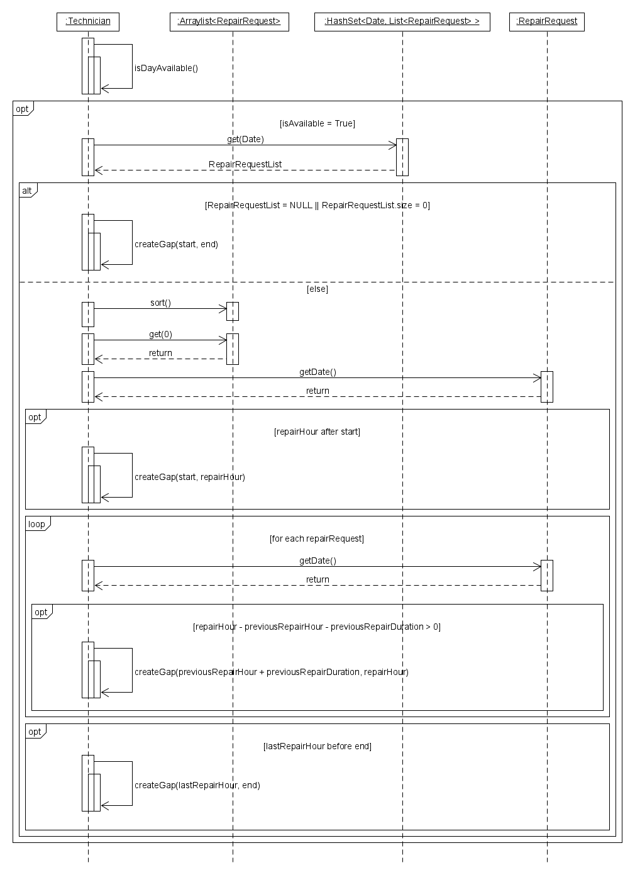

#### Διαγράμματα ακολουθίας για μεθόδους των presenter

##### Complete στο TechnicianConfirmedRepairRequest

##### Confirm στο TechnicianUnconfirmedRepairRequest

##### onRepairRequestSelectedCompleted στο CustomerRepairRequests

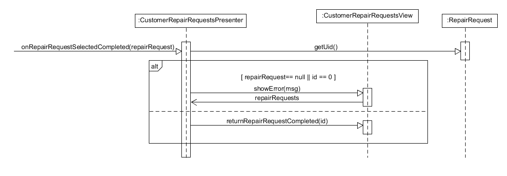

##### onRepairRequestSelectedCompleted στο TechnicanRepairRequests

##### onRepairRequestSelectedConfirmed στο CustomerRepairRequests

##### onRepairRequestSelectedConfirmed στο TechnicianRepairRequests

##### onRepairRequestSelectedUnConfirmed στο TechnicianRepairRequests

##### searchRepairRequestData στο CustomerCompletedRepairRequest

##### searchRepairRequestData στο CustomerConfirmedRepairRequest

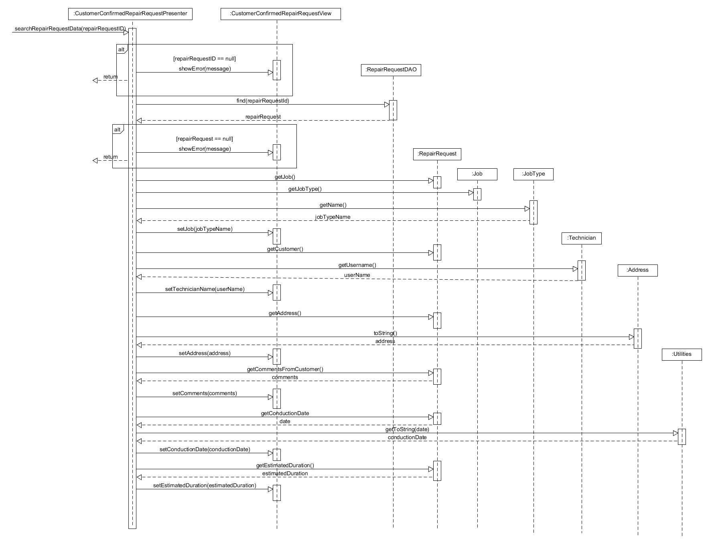

##### searchRepairRequestData στο CustomerUnConfirmedRepairRequest

##### searchRepairRequestData στο TechnicianCompletedRepairRequest

##### searchRepairRequestData στο TechnicianConfirmedRepairRequest

##### searchRepairRequestData στο TechnicianUnConfirmedRepairRequest

##### searchRepairRequests στο TechnicianRepairRequests

##### requestRepair στο RequestRepair

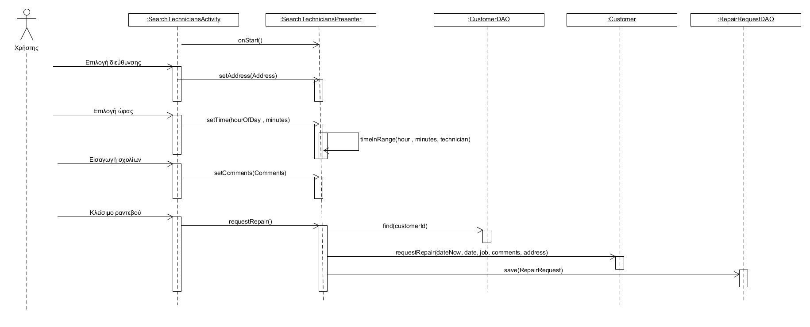

##### searchTechnicians στο SearchTechnician

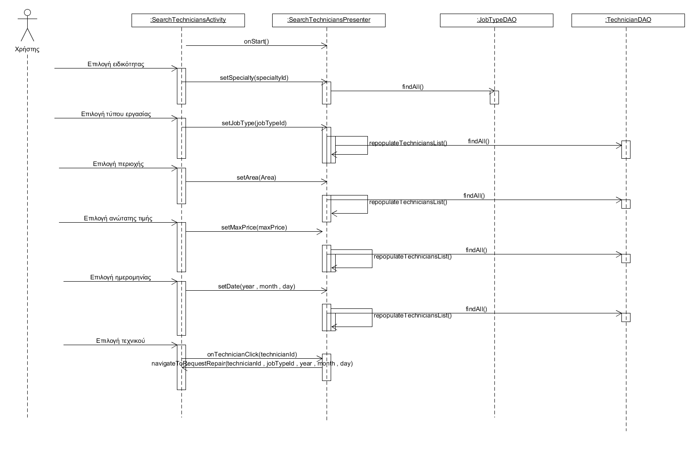

##### customerRegister στο CustomerRegister

##### technicianRegister στο TechnicianRegister

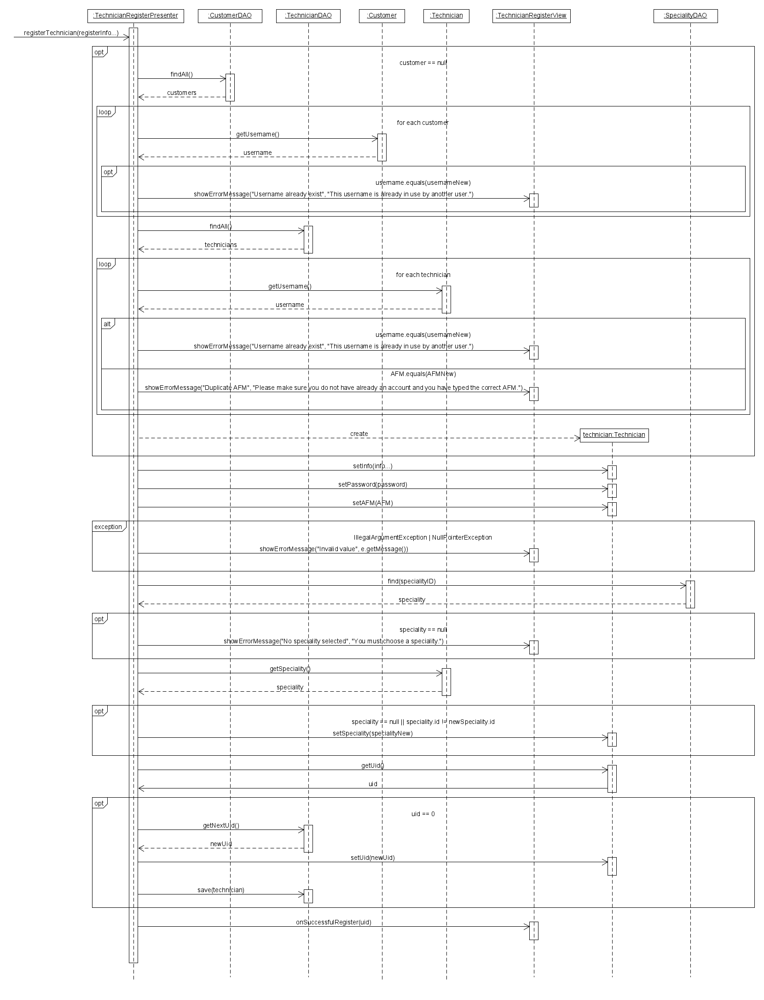

##### login στο Login

