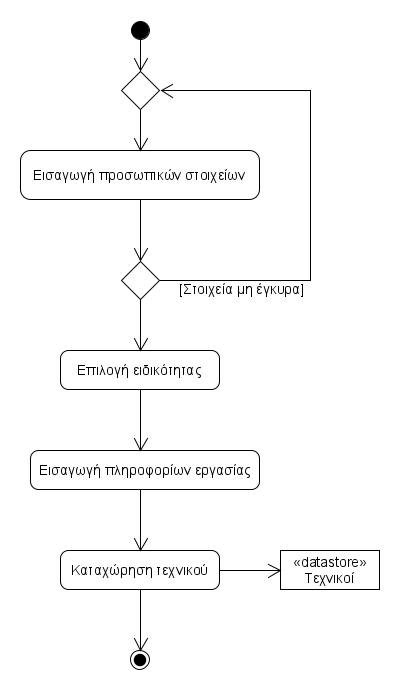

# ΠΧ1. Εγγραφή Τεχνικού

**Πρωτεύων Actor**: Τεχνικός

**Ενδιαφερόμενοι**: 

**Τεχνικός**: Θέλει να δημουργήσει ή να επεξεργαστεί τον λογαριασμό του. 

## Βασική Ροή

### Α) Εγγραφή Τεχνικού
1. Ο τεχνικός εισάγει τα προσωπικά του στοιχεία(ονομα , επιθετο , τραπεζικος λογαριασμος , ονοματεπώνυμο , κωδικός πρόσβασης , τηλέφωνο , email ).
2. Το σύστημα ελέγχει την εγκυρότητα των στοιχείων που έδωσε ο τεχνικός.
3. Ο τεχνικός επιλέγει την ειδικότητα του από τις διαθέσιμες ειδικότητες.
4. Ο τεχνικός εισάγει τις εργασίες που μπορεί να αναλάβει, το ωράριο εργασίας του, τις περιοχές που εξυπηρετεί καθώς και το κόστος για κάθε εργασία.
5. Το σύστημα καταχωρεί τον τεχνικό.

#### Εναλλακτικές Ροές

\* *Ο τεχνικός επιλέγει ακύρωση δημιουργίας λογαριασμού.*
1. Η περίπτωση χρήσης τερματίζει.

*3α. Τα στοιχεία του τεχνικού δεν είναι έγκυρα καθώς παραβιάζεται ένας από τους κανόνες: [ΕΚ1, EK2, EK3, ΕΚ4, ΕΚ7](../README.md#business-rules#)*
1. Το σύστημα εμφανίζει μήνυμα σφάλματος.
2. Η περίπτωση χρήσης επιστρέφει στο βήμα 1.

### Β) Ενημέρωση στοιχείων τεχνικού
1. [Ταυτοποίηση Χρήστη](uc8-validate-user.md)
2. Ο Τεχνικός επιλέγει την επεξεργασία των στοιχείων του.
3. Το σύστημα εμφανίζει τα στοιχεία του τεχνικού.
4. Ο Τεχνικός τροποποιεί τα στοιχεία που επιθυμεί(κωδικός, email, τηλέφωνο, τραπεζικός λογαριασμός, εργασίες, ωράριο, περιοχές).
5. Ο Τεχνικός υποβάλει τα ενημερωμένα στοιχεία.
6. Το σύστημα ελέγχει την εγκυρότητα των στοιχείων.
7. Το σύστημα ενημερώνει τα στοιχεία του τεχνικού.

#### Εναλλακτικές Ροές

\* *Ο τεχνικός επιλέγει ακύρωση ενημέρωσσης στοιχείων λογαριασμού.*
1. Η περίπτωση χρήσης τερματίζει.

*6α. Τα νέα στοιχεία του τεχνικού δεν είναι έγκυρα καθώς παραβιάζεται ένας από τους κανόνες [ΕΚ1, EK2, EK4, ΕΚ5](../README.md#business-rules#)*
1. Το σύστημα εμφανίζει μήνυμα σφάλματος.
2. Η περίπτωση χρήσης επιστρέφει στο βήμα 3.

### Γ) Διαγραφή Τεχνικού
1. [Ταυτοποίηση Χρήστη](uc8-validate-user.md)
2. Ο Τεχνικός επιλέγει την διαγραφή του λογαριασμού του.
3. Το σύστημα ελέγχει αν είναι δυνατόν να πραγματοποιηθεί η διαγραφή με βάση τους κανόνες.
4. Το σύστημα εμφανίζει ένα μήνυμα επιβεβαίωσης για την διαγραφή.
5. Ο Τεχνικός επιβεβαιώνει την διαγραφή.
6. Το σύστημα αφαιρεί τον τεχνικό.

#### Εναλλακτικές Ροές
*3. Το σύστημα δεν επιτρέπει την διαφραφή.
1. Το σύστημα εμφανίζει ενημερωτικό μήνυμα στον τεχνικό σχετικά με τους κανόνες που παραβιάζονται [ΕΚ9](../README.md#business-rules#).
2. Η περίπτωση χρήσης τερματίζει.

*4. Ο Τεχνικός δεν επιβεβαιώνει την διαγραφή.
Η περίπτωση χρήσης τερματίζει.

## Διαγράμματα

### Διάγραμμα δραστηριότητας

### Διάγραμμα ακολουθίας 

