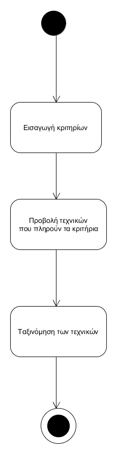
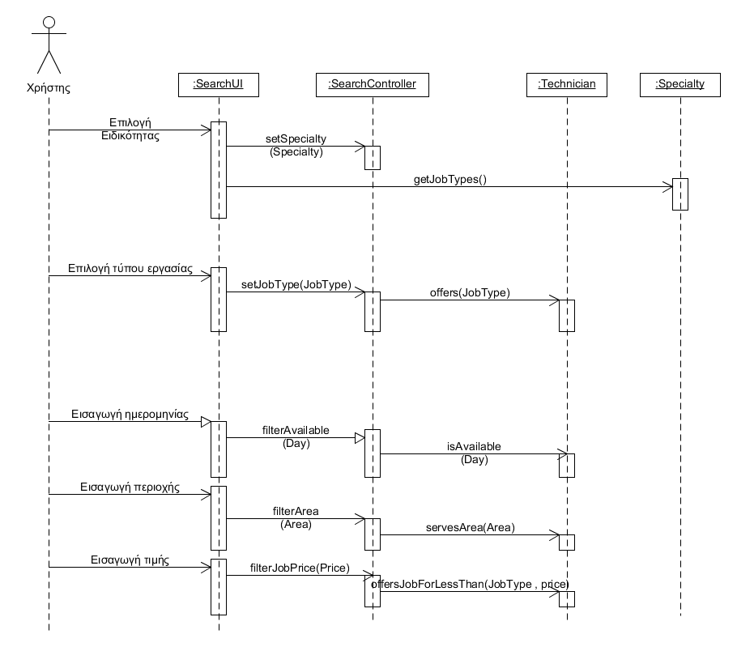

# ΠΧ3. Αναζήτηση

**Πρωτεύων Actor**: Πελάτης  
**Ενδιαφερόμενοι**  
**Πελάτης**: Θέλει να βρει εναν τεχνικό για να ολοκληρώσει μια εργασία.  
**Τεχνικός**: Θέλει να μπορούν να τον αναζητούν πιθανοί μελλοντικοί πελάτες του.  
**Προϋποθέσεις**: Υπάρχουν εγγεγραμένοι τεχνικοί στο σύστημα.  

## Βασική Ροή
1. Ο πελάτης επιλέγει την ειδικότητα του τεχνικού
2. Το σύστημα προβάλει τους τύπους εργασίας για αυτήν την ειδικότητα
3. Ο πελάτης επιλέγει τον τύπο εργασίας απο αυτούς τους τύπους 
4. Το σύστημα προβάλλει τους τεχνικούς που προσφέρουν τον συγκεκριμένο τύπο εργασίας
5. Ο πελάτης εισάγει τα κριτήρια αναζήτησης (τιμή εργασίας , περιοχή , ημερόμηνια διαθεσιμότας)
6. Το σύστημα εμφανίζει όλους τους τεχνικούς που πληρούν τα κριτήρια

## Διαγράμματα

### Διάγραμμα δραστηριότητας

### Διάγραμμα ακολουθίας

