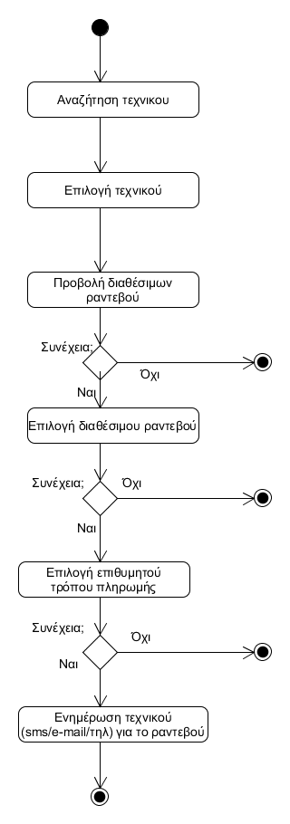
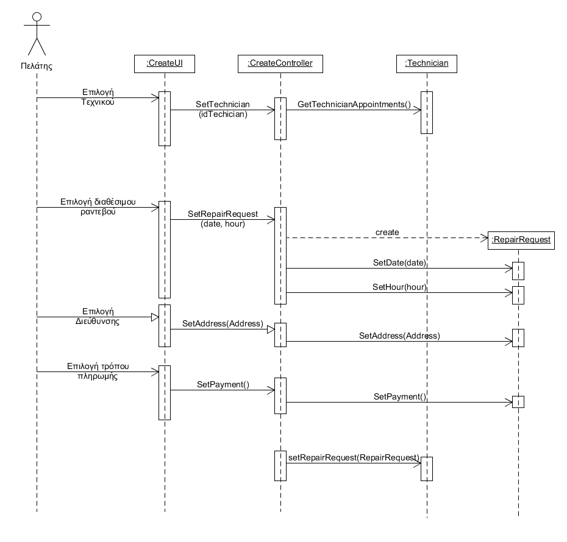

# ΠΧ4. Δημιουργία ραντεβού

**Πρωτεύων Actor**: Πελάτης
**Ενδιαφερόμενοι**: Τεχνικός

 
**Πελάτης**: Θέλει να προσλάβει έναν τεχνικό για να διεκπεραιώσει μια εργασία.
**Τεχνικος**: Θέλει να αναλάβει μια εργασία για να πληρωθεί.
  
**Προϋποθέσεις**: Ο πελάτης είναι εγγεγραμμένος στο σύστημα και έχιε ταυτοποιηθεί. Υπάρχουν εγγεγραμένοι τεχνικοί στο σύστημα.

## Βασική Ροή

1. [Ο πελάτης αναζητεί για τεχνικούς που πληρούν τα κριτήρια](uc2-search-technician.md)
2. Ο πελάτης επιλέγει τεχνικό.
3. Το σύστημα προβάλει τα διαθέσιμα εύρη ωρών του τεχνικού.
4. Ο πελάτης επιλέγει μια ώρα της ημέρας για το ραντεβού.
5. Το σύστημα ελέγχει αν η ώρα ανήκει στα διαθέσιμα εύρη.
6. Ο πελάτης δίνει την διεύθυνση διεξαγωγής του ραντεβού.
7. Το σύστημα εμφανίζει τις λεπτομέρειες της αίτησης
8. Ο πελάτης επιβεβαιώνει το αίτημα
9. Το σύστημα ειδοποιεί τον τεχνικό πως ενας πελάτης ζητάει ενα ραντεβού(με βάση τον τρόπο που έχει επιλέξει να ειδοποιείται: sms/τηλ/e-mail).

## Εναλλακτικές Ροές

\* *Ο  Ο πελάτης ακυρώνει το αίτημα για ραντεβού.*
1. Η περίπτωση χρήσης τερματίζει.
 
*3α. Ο πελάτης δεν ικανοποιείται από τα διαθέσιμα ραντεβού του τεχνικού και θέλει να ψάξει για άλλο τεχνικό*
1. Η περίπτωση χρήσης επιστρέφει στο βήμα 2 της βασικής ροής.

## Διαγράμματα

### Διάγραμμα δραστηριότητας 

### Διάγραμμα ακολουθίας

