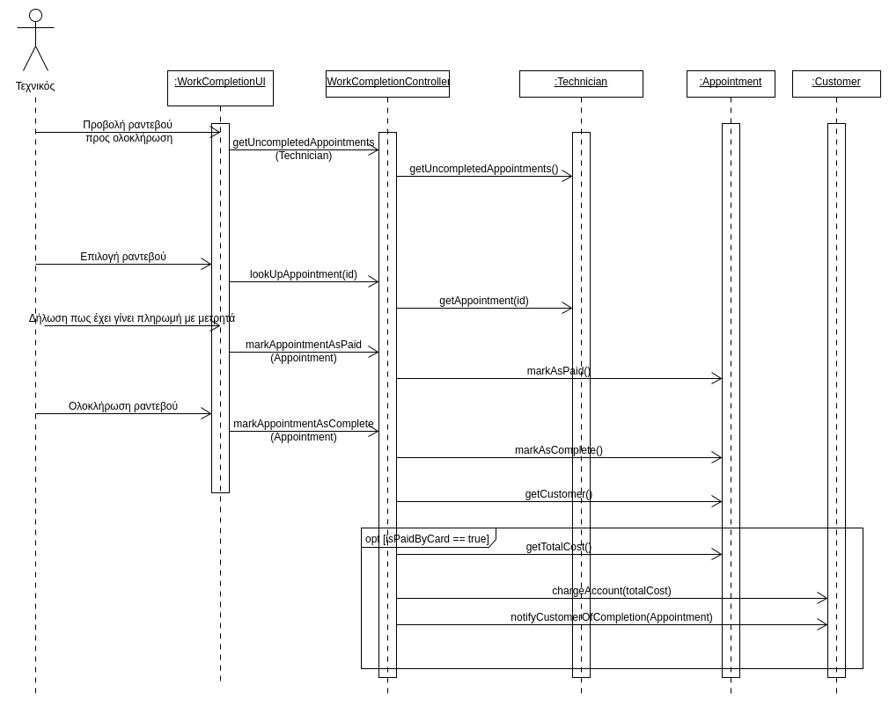

# ΠΧ5. Ολοκλήρωση εργασίας

**Πρωτεύων Actor**:  Τεχνικός  
**Ενδιαφερόμενοι**: Πελάτης  
**Τεχνικος**: Θέλει να πληρωθεί.   
**Πελάτης**: Θέλει να εξοφλήσει και να αξιολογήσει τον τεχνικό.  
**Προϋποθέσεις**: Ο τεχνικός έχει συνδεθεί στον προσωπικό του λογαριασμό, έχει δημιουργηθεί ένα ραντεβού με κάποιον πελάτη και το ραντεβού έχει ολοκληρωθεί.

## Βασική Ροή
1. Ο τεχνικός επιλέγει να του εμφανιστούν τα αιτήματα ραντεβού.
2. Το σύστημα εμφανίζει στον τεχνικό όλα τα ραντεβού που έχει αναλάβει.
3. Ο τεχνικός επιλέγει το αίτημα ραντεβού που ολοκλήρωσε για να σημειωθεί ως ολοκληρωμένο.
4. Ο τεχνικός επιλέγει εάν έχει εξοφλήσει ο πελάτης με μετρητά ή όχι.
5. Ο τεχνικός επιβεβαιώνει ότι ολοκληρώθηκε 
6. Στέλνεται ειδοποίηση αυτόματα στον πελάτη.
7. Ο πελάτης έχει τη δυνατότητα να αξιολογήσει και να βαθμολογήσει τον τεχνικό.

## Εναλλακτικές Ροές

*5α. Έχει επιλεγεί από τον τεχνικό ότι ο πελάτης έχει εξοφλήσει με μετρητά*
1. Δεν εκτελείται η συναλλαγή.

## Διαγράμματα

### Διάγραμμα δραστηριότητας - Ολοκλήρωση εργασίας

### Διάγραμμα ακολουθίας 

