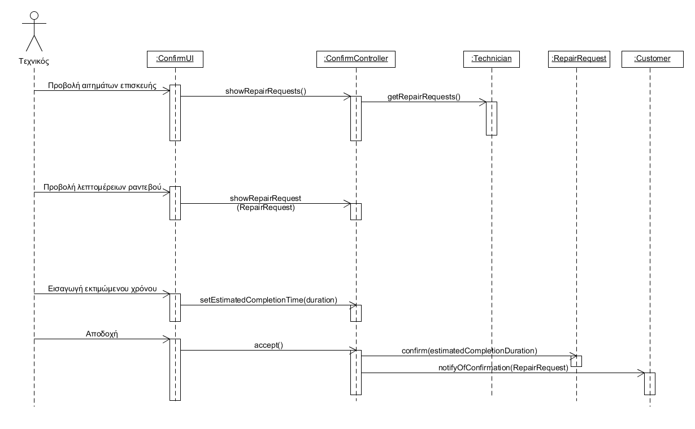

# ΠΧ6. Επιβεβαίωση ραντεβού

**Πρωτεύων Actor**: Τεχνικός
**Ενδιαφερόμενοι**: Πελάτης

 

**Τεχνικος**: Θέλει να επιβεβαιώσει ένα ραντεβού για να αναλάβει την εργασία.
**Πελάτης**: Θέλει να επιβεβαιωθεί το αίτημα του για ραντεβού.  
  
  
**Προϋποθέσεις**: Ο τεχνικός έχει κάποιο αίτημα για ραντεβού.

### Α) Αποδοχή ραντεβού

## Βασική Ροή

1. Ο τεχνικός αιτεί απο το σύστημα να δεί τα αιτήματα για ραντεβού.
2. Το σύστημα προβάλει τις αιτήσεις για ραντεβού.
3. Ο τεχνικός επιλέγει μια αίτηση που δεν έχει επιβεβαιώσει.
4. Το σύστημα του προβάλει τις λεπτομέρειες της αίτησης
5. Ο τεχνικός εισάγει την εκτιμώμενη διάρκεια της επισκευής και το επιβεβαιώνει.
6. Το σύστημα ειδοποιεί τον πελάτη που έκανε την συγκεκριμένη αίτηση για ραντεβού για την αποδοχή.

### Β) Απόρριψη ραντεβού

## Βασική Ροή

1. Ο τεχνικός αιτεί απο το σύστημα να δεί τα αιτήματα για ραντεβού.
2. Το σύστημα προβάλει τις αιτήσεις για ραντεβού.
3. Ο τεχνικός επιλέγει μια αίτηση που δεν έχει επιβεβαιώσει.
4. Το σύστημα του προβάλει τις λεπτομέρειες της αίτησης
5. Ο τεχνικός απορρίπτει την αίτηση και εισάγει προαιρετικά τον λόγο απόρριψης.
6. Το σύστημα ειδοποιεί τον πελάτη που έκανε την συγκεκριμένη αίτηση για ραντεβού για την απόρριψη.

   
## Διαγράμματα

### Διάγραμμα ακολουθίας 

