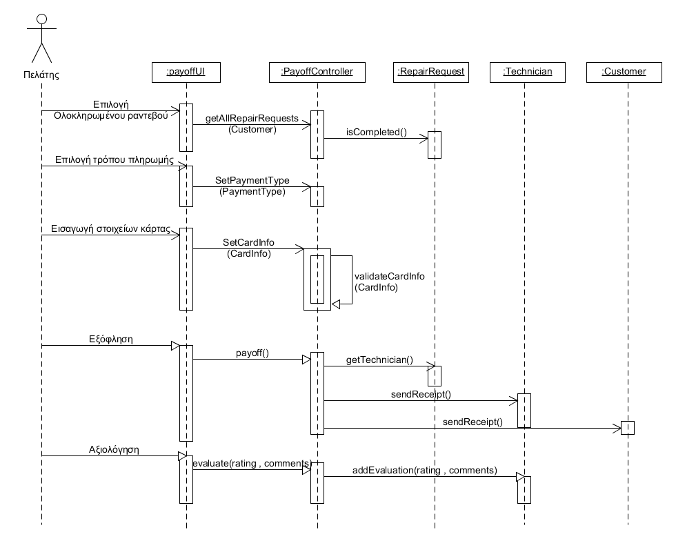

# ΠΧ7. Εξόφληση Τεχνικού

**Πρωτεύων Actor**: Πελάτης

**Ενδιαφερόμενοι**

**Τεχνικός**: Θέλει να πληρωθεί για την εργασία του.

**Πελάτης**: Θέλει να εξοφλύσει τον τεχνικό και να αξιολογήσει τις υπηρεσίες που έλαβε.

**Προϋποθέσεις**: Να έχει δημιουργηθεί ραντεβού. Ο τεχνικός να έχει επιβεβαιώσει το ραντεβού.

## Βασική Ροή

### Α) Εξόφληση Τεχνικού
1. Ο πελάτης επιλέγει το ραντεβού που είναι μαρκαρισμένο ώς ολοκληρωμένο.
2. Ο πελάτης επιλέγει να πληρώσει με χρήση πιστωτικής κάρτας.
3. Ο πελάτης εισάγει τα στοιχεία της κάρτας.
4. Το σύστημα ελέγχει την εγκυρότητα των στοιχείων της κάρτας.
5. Το σύστημα ολοκληρώνει την εξόφληση του τεχνικού και στέλνει και στον πελάτη και στον τεχνικό την απόδειξη μέσω mail.
6. To συστημα ζητάει από τον πελάτη να αξιολογήσει τον τεχνικό.
7. Ο πελάτης εισάγει μια σύντομη αξιολόγηση.
8. Το σύστημα καταχωρεί την αξιολόγηση του πελάτη για τον τεχνικό.

#### Εναλλακτικές Ροές

*2α. Ο πελάτης επιλέγει να πληρώσει με μετρητά.*
1. Το σύστημα δεσμεύει ένα ποσό προμήθειας από τον τεχνικό.
2. Η περιπτωση χρήσης πηγαίνει ατο βήμα 5.

*4α. Τα στοιχεία της κάρτας του πελάτη δεν είναι έγκυρα καθώς παραβιάζεται ένας από τους κανόνες.*
1. Το σύστημα εμφανίζει μήνυμα λάθους στον πελάτη.
2. Η περίπτωση χρήσης επιστρέφει στο βήμα 2.

## Διαγράμματα

### Διάγραμμα ακολουθίας 

