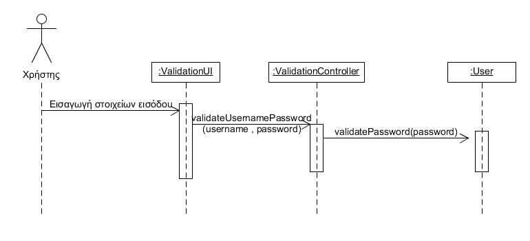

# ΠΧ8. Ταυτοποίηση Χρήστη

**Πρωτεύων Actor**: Χρήστης  
**Ενδιαφερόμενοι**:

**Τεχνικός**: Θέλει να ταυτοποιηθεί από το σύστημα για να διαχειριστεί τα ραντεβού του.

**Πελάτης**: Θέλει να ταυτοποιηθεί από το σύστημα για να αναζητήσει κάποιον τεχνικό για να κλείσει ραντεβού.

## Βασική Ροή

### Α) Ταυτοποίηση Χρήστη
1. O χρήστης εισάγει τα στοιχεία εισόδου του στο σύστημα(username, password).
2. Το σύστημα ελέγχει την εγκυρότητα των στοιχείων εισόδου.
3. Ο χρήστης ταυτοποιείται από το σύστημα.

#### Εναλλακτικές Ροές

*2α. Τα στοιχεία εισόδου του χρήστη δεν είναι έγκυρα.*
1. Το σύστημα εμφανίζει μήνυμα σφάλματος.
2. Η περίπτωση χρήσης επιστρέφει στο βήμα 1.

### Διάγραμμα ακολουθίας 

